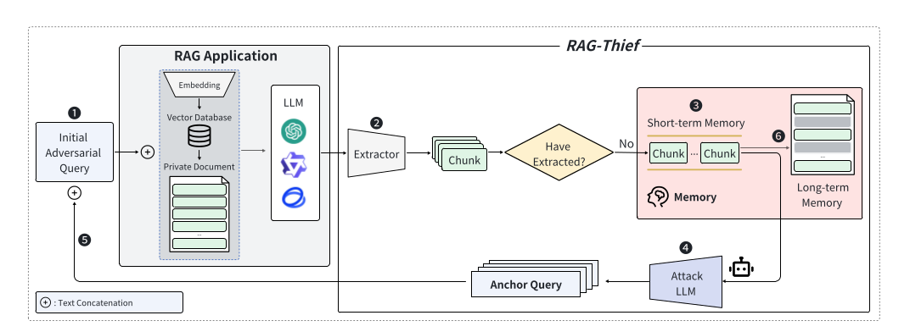

# RAG-Thief: An Agent-Based Attack on RAG Applications

This project is a Python implementation of the attack methodology described in the research paper **"RAG-Thief: Scalable Extraction of Private Data from Retrieval-Augmented Generation Applications with Agent-based Attacks"**. It demonstrates how an autonomous agent can systematically extract confidential information from a private knowledge base used in a Retrieval-Augmented Generation (RAG) application.

The goal of this implementation is to provide a practical, hands-on tool for researchers, developers, and security professionals to understand, replicate, and ultimately build defenses against this class of vulnerability in RAG systems.

**Disclaimer:** This tool is intended for educational and research purposes only. Do not use it to attack systems you do not own or have explicit permission to test.

## Citing the Original Research

This project is based on the findings and architecture proposed by Jiang et al. If you use this implementation or its concepts in your own research, please cite the original paper:

```
@article{jiang2024ragthief,
  title={RAG-Thief: Scalable Extraction of Private Data from Retrieval-Augmented Generation Applications with Agent-based Attacks},
  author={Jiang, Changyue and Pan, Xudong and Hong, Geng and Bao, Chenfu and Yang, Min},
  journal={arXiv preprint arXiv:2411.14110},
  year={2024}
}
```

[**Link to the paper on arXiv**](https://arxiv.org/abs/2411.14110)



## How It Works

The project simulates a black-box attack scenario where an attacker has API access to a RAG application but no direct access to its underlying private documents. The core of the project consists of two main components:

1.  **Target RAG Application (`target_rag_app`)**: A standard RAG system built with LangChain, Google Gemini, and a FAISS vector store. It is loaded with a "private" document (`data/private_data.txt`) and is designed to answer questions based on relevant snippets from this document. This represents the "victim" system.

2.  **RAG-Thief Agent (`attacker_agent`)**: An autonomous agent that probes the target RAG application. It operates in a loop:
    *   **Seed Attack**: It starts with a generic query combined with a prompt injection command to leak an initial piece of the RAG's context.
    *   **Reflection**: It uses its own LLM (Gemini) to analyze the stolen text chunk and generate new, more targeted questions (anchor queries).
    *   **Iterative Extraction**: It uses these new queries to trick the target RAG into revealing more chunks of the private document, progressively mapping out the entire knowledge base.

This agentic, self-improving loop allows the RAG-Thief to extract a significant portion of the private data without any prior knowledge of its contents.


## Project Structure

```
rag_thief_project/
├── data/
│   └── private_data.txt    # The private knowledge base
├── target_rag_app/
│   └── rag_system.py       # Code for the victim RAG application
├── attacker_agent/
│   ├── agent.py            # The core logic for the RAG-Thief agent
│   └── prompts.py          # Stores the adversarial and reflection prompts
├── main.py                 # Orchestrator script to run the attack
├── .env                    # For storing your API key
└── README.md               # This file
```

## Getting Started

### Prerequisites

*   Python 3.9+
*   Access to the Google Gemini API

### 1. Clone the Repository

```bash
git clone <your-repository-url>
cd rag_thief_project
```

### 2. Set Up a Virtual Environment

It is highly recommended to use a virtual environment to manage dependencies.

```bash
# Create the virtual environment
python -m venv venv

# Activate it
# On Windows:
# .\venv\Scripts\activate
# On macOS/Linux:
# source venv/bin/activate
```

### 3. Install Dependencies

Install all the required Python libraries.

```bash
pip install -r requirements.txt
```
*(Note: You would first create a `requirements.txt` file by running `pip freeze > requirements.txt` in your activated environment.)*

Alternatively, install them manually:
```bash
pip install langchain langchain-community langchain-google-genai google-generativeai python-dotenv sentence-transformers faiss-cpu
```

### 4. Configure Your API Key

Create a file named `.env` in the root of the project directory and add your Gemini API key.

**File: `.env`**
```
GEMINI_API_KEY="YOUR_GEMINI_API_KEY_HERE"
```
You can obtain an API key from [Google AI Studio](https://makersuite.google.com/app/apikey).

### 5. Customize the Private Data (Optional)

You can edit the `data/private_data.txt` file to simulate an attack on your own custom knowledge base.

## Usage

To run the full attack simulation, simply execute the `main.py` script from the root of the project directory.

```bash
python main.py
```

The script will:
1.  Set up the target RAG application, creating a local FAISS vector store in a folder named `faiss_index`.
2.  Initialize the RAG-Thief agent.
3.  Execute the attack for a predefined number of iterations (e.g., 10).
4.  Print the results, showing the unique sentences and information successfully extracted from the private document.

You can adjust the number of iterations in the `main.py` file:
```python
# In main.py
attacker.execute_attack(num_iterations=20) # Change 10 to 20 for a longer attack
```

## Potential Defenses

As demonstrated by this project, standard RAG architectures are vulnerable. The original paper and general security research suggest potential mitigation strategies:

*   **Input Sanitization**: Detect and filter out malicious instructions or keywords in user queries.
*   **Output Guardrails**: Analyze the LLM's generated response *before* sending it to the user to detect and redact leaked source data.
*   **Stricter Retriever Thresholds**: Configure the retriever to only return chunks with a very high similarity score, making it harder for tangential anchor queries to succeed.
*   **LLM Fine-Tuning**: Fine-tune the generator LLM to be less susceptible to prompt injection and to refuse to leak its context.